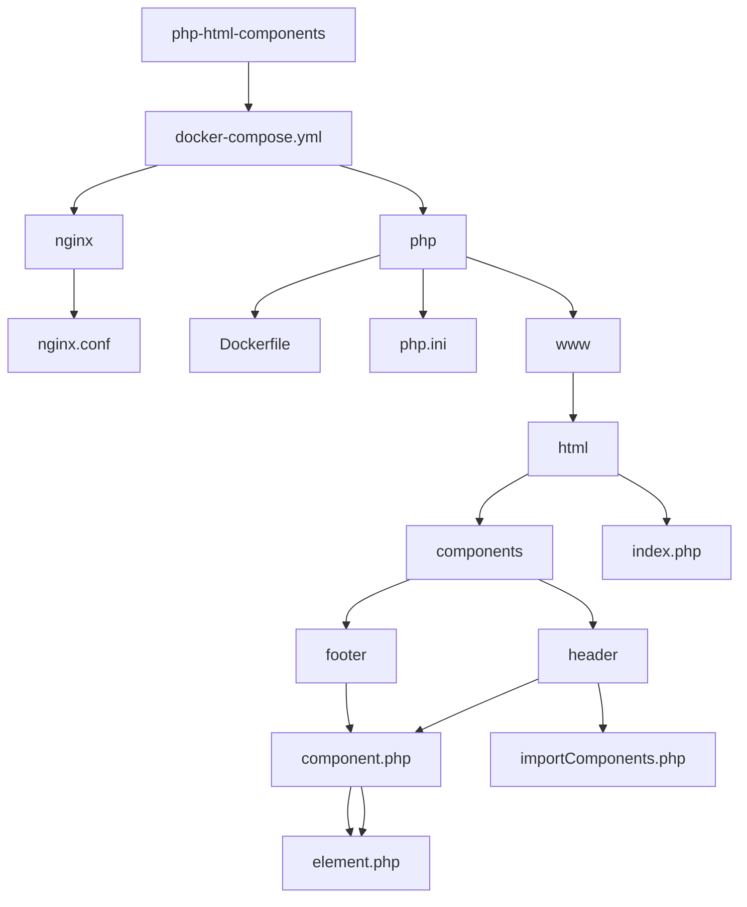

# README

## 概要
このプログラムは、PHPで作られたヘッダーコンポーネントのクラスです。
コンストラクタでタイトルを指定し、renderメソッドを呼び出すことでヘッダーコンポーネントが表示できます。

## クラス
### HeaderComponent
#### プロパティ
- `$title` : string型 タイトル
#### メソッド
##### `__construct($title)`
- 引数 : string型
- 戻り値 : なし
- 概要 : タイトルを設定します。
##### `render()`
- 引数 : なし
- 戻り値 : なし
- 概要 : ヘッダーコンポーネントを表示します。


## ディレクトリ構成
```
└──php-html-components
    ├──docker-compose.yml
    ├──nginx
    │   └──nginx.conf
    ├──php
    │   ├──Dockerfile
    │   └──php.ini
    └──www
        └──html
            ├──components
            │   ├──footer
            │   │   ├──component.php
            │   │   └──element.php
            │   ├──header
            │   │   ├──component.php
            │   │   └──element.php
            │   └──importComponents.php
            └──index.php
```

## 構成図
